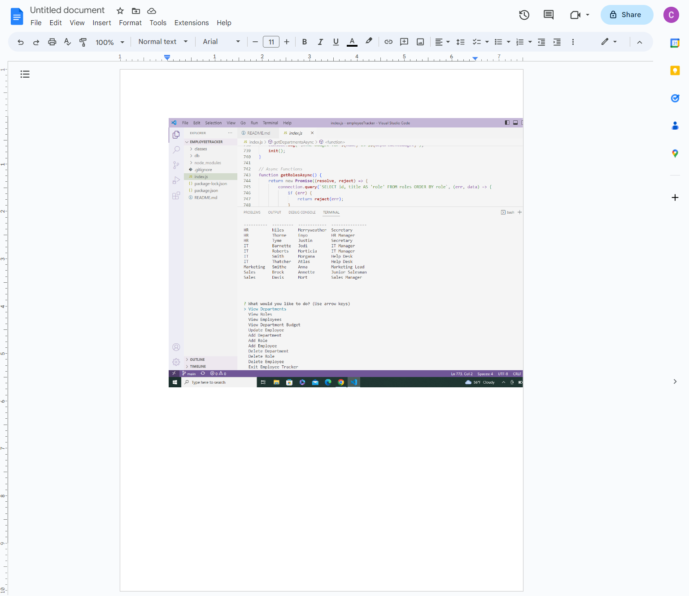

# employeeTracker
An employee tracker within the SQL database 

## Description
My motivation for this project was to test my new skills in MySQL. I built this project to create a database for employee tracker. This solved the problem of having a centralized location for employee information.  I learned that MySQL is very repetative and a lot of copy and editing the first bit of code was needed.  

## Installation
None 

## Usage

Usage is available on localhost network 
[link to deployed video](https://drive.google.com/file/d/1T71CbLMvI5M6422IueASMSqcNwmXevWx/view)

## Credits

For this project, I utilized help with the following books: 
PHP 5/MySQL 
SQL in easy steps 
PHP/MySQL in easy steps 

I also used the help of a friend who does SQL for her daily job: K. Lehman 
## License

None

